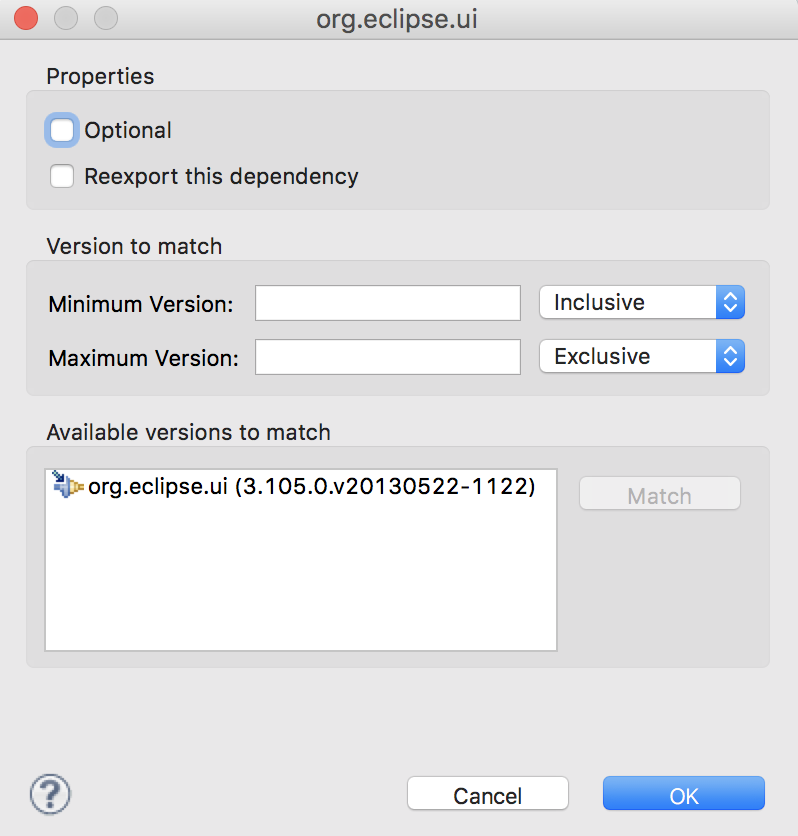

# Understanding MANIFEST.MF view



#### General information

| **ID** | It refers to the ID of this plugin. It will be used by other plugins to connect with this plugin. e.g. : `com.eclipse.basic`  |
| --- | --- | --- | --- | --- |
| **Version** | When other plugins will integrate with your plugin, it will provide version also with the `ID` to uniquely identify the code. |
| **Name** | Name is used as Metadata for the plugin |
| **Vendor** | Name of the vendor this plugin belongs to. |
| **Activator** | It will refer to the first class \(Activator\) has to be called when this plugin will execute. |

 



| Required Plugins | List of Plug-ins required by the current plugin. Each plugin would have dependency on the other plugins and uses the code of other plugin.   in required Plugin, the version \(or range of version\) of the Plug-in can also me mentioned which is required.For example, the basic eclipse plugins are `org.eclipse.ui` will be used for various UI design.Version can me mentioned here :   |
| --- | --- |
| Imported Packages | Instead of entire plugin only some specific package of the plugin is required, then it has to be specified here. |



