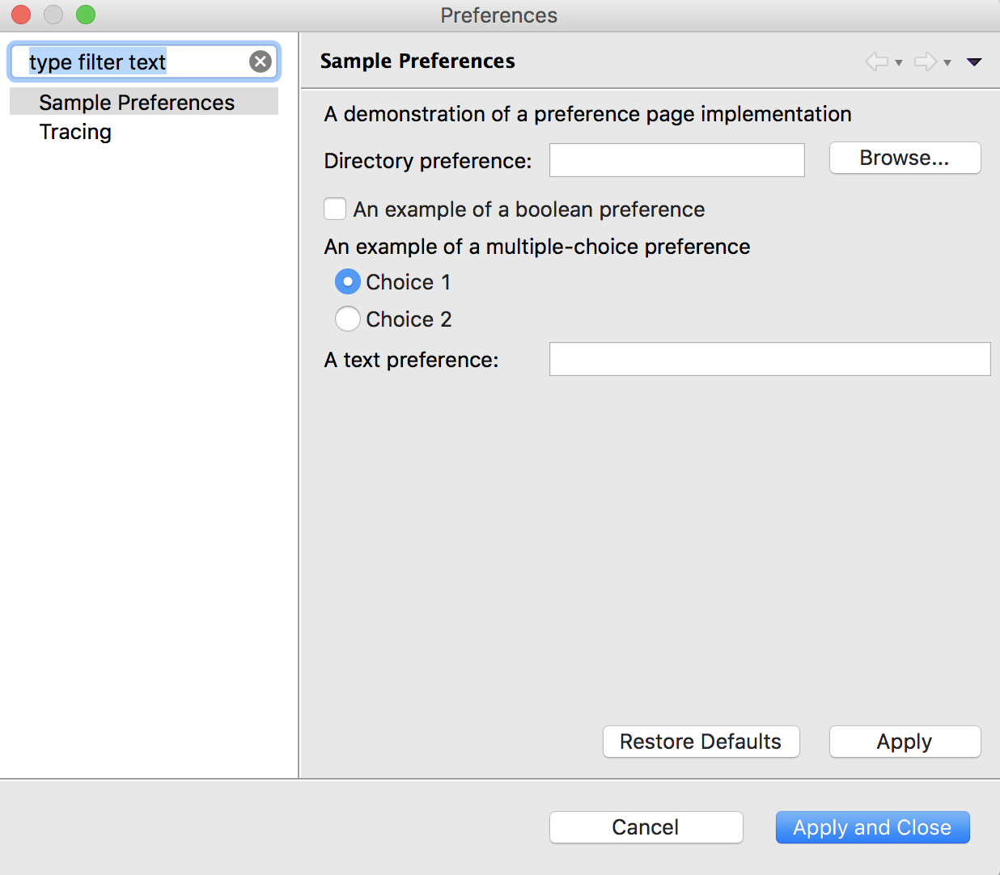

# Preferences in RCP

## Preferences

Preference pages will be appear **Window&gt;Preferences** dialog. It can be used to configure different features from once place. Eclipse Preferences is kind of registry of configurations.

e.g.:

As you see here are the various configuration \( preferences \) for Java, Ant, etc.



**org.eclipse.ui.preferencePages** extension has to be added to in the plug-in manifest editor for Preference Pages.



Once you add the extension, the following will be the structure:


Following is the implementation of `SamplePreferencePage.java`



```java
package trial.preferences;

import org.eclipse.jface.preference.BooleanFieldEditor;
import org.eclipse.jface.preference.DirectoryFieldEditor;
import org.eclipse.jface.preference.FieldEditorPreferencePage;
import org.eclipse.jface.preference.RadioGroupFieldEditor;
import org.eclipse.jface.preference.StringFieldEditor;
import org.eclipse.ui.IWorkbench;
import org.eclipse.ui.IWorkbenchPreferencePage;
import org.eclipse.ui.PlatformUI;

/**
 * This class represents a preference page that
 * is contributed to the Preferences dialog. By 
 * subclassing <samp>FieldEditorPreferencePage</samp>, we
 * can use the field support built into JFace that allows
 * us to create a page that is small and knows how to 
 * save, restore and apply itself.
 * <p>
 * This page is used to modify preferences only. They
 * are stored in the preference store that belongs to
 * the main plug-in class. That way, preferences can
 * be accessed directly via the preference store.
 */

public class SamplePreferencePage
	extends FieldEditorPreferencePage
	implements IWorkbenchPreferencePage {

	public SamplePreferencePage() {
		super(GRID);
		
		setPreferenceStore(PlatformUI.getPreferenceStore());
		setDescription("A demonstration of a preference page implementation");
	}
	
	/**
	 * Creates the field editors. Field editors are abstractions of
	 * the common GUI blocks needed to manipulate various types
	 * of preferences. Each field editor knows how to save and
	 * restore itself.
	 */
	public void createFieldEditors() {
		addField(new DirectoryFieldEditor(PreferenceConstants.P_PATH, 
				"&Directory preference:", getFieldEditorParent()));
		addField(
			new BooleanFieldEditor(
				PreferenceConstants.P_BOOLEAN,
				"&An example of a boolean preference",
				getFieldEditorParent()));

		addField(new RadioGroupFieldEditor(
				PreferenceConstants.P_CHOICE,
			"An example of a multiple-choice preference",
			1,
			new String[][] { { "&Choice 1", "choice1" }, {
				"C&hoice 2", "choice2" }
		}, getFieldEditorParent()));
		addField(
			new StringFieldEditor(PreferenceConstants.P_STRING, "A &text preference:", getFieldEditorParent()));
	}

	/* (non-Javadoc)
	 * @see org.eclipse.ui.IWorkbenchPreferencePage#init(org.eclipse.ui.IWorkbench)
	 */
	public void init(IWorkbench workbench) {
	}
	
}
```



Following is the code for `PreferenceConstants.java`



```java
package trial.preferences;

/**
 * Constant definitions for plug-in preferences
 */
public class PreferenceConstants {

	public static final String P_PATH = "pathPreference";

	public static final String P_BOOLEAN = "booleanPreference";

	public static final String P_CHOICE = "choicePreference";

	public static final String P_STRING = "stringPreference";
	
}

```



Code for `PreferenceInitializer.java`



```java
package trial.preferences;

import org.eclipse.core.runtime.preferences.AbstractPreferenceInitializer;
import org.eclipse.jface.preference.IPreferenceStore;
import org.eclipse.ui.PlatformUI;

/**
 * Class used to initialize default preference values.
 */
public class PreferenceInitializer extends AbstractPreferenceInitializer {

	/*
	 * (non-Javadoc)
	 * 
	 * @see org.eclipse.core.runtime.preferences.AbstractPreferenceInitializer#initializeDefaultPreferences()
	 */
	public void initializeDefaultPreferences() {
		IPreferenceStore store = PlatformUI.getPreferenceStore();
		store.setDefault(PreferenceConstants.P_BOOLEAN, true);
		store.setDefault(PreferenceConstants.P_CHOICE, "choice2");
		store.setDefault(PreferenceConstants.P_STRING,
				"Default value");
	}

}

```



Once you run the Application as Eclipse Application post the above configuration, following will be the preference page:



**Getting and Setting Preferences**

Preferences for a plug-in are stored in an `org.eclipse.jface.preference.IPreferenceStore` object. You can access a plug-ins preference through the `Activator`


